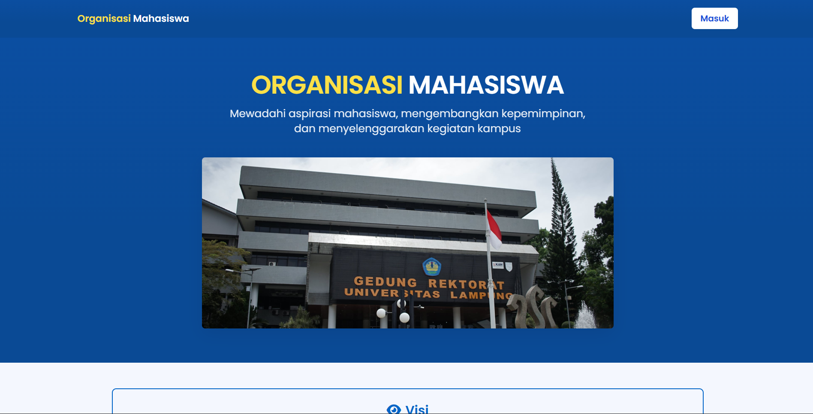
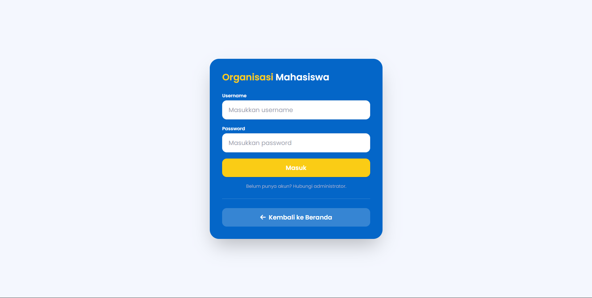
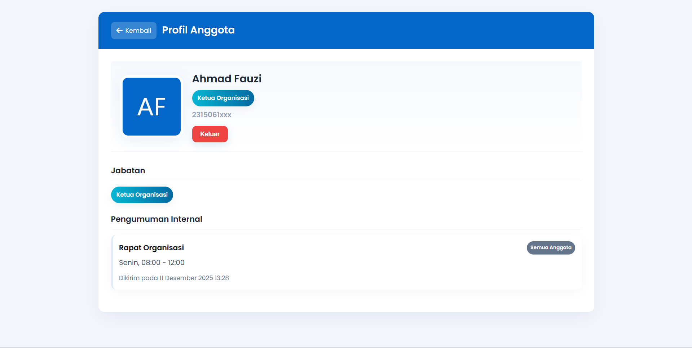
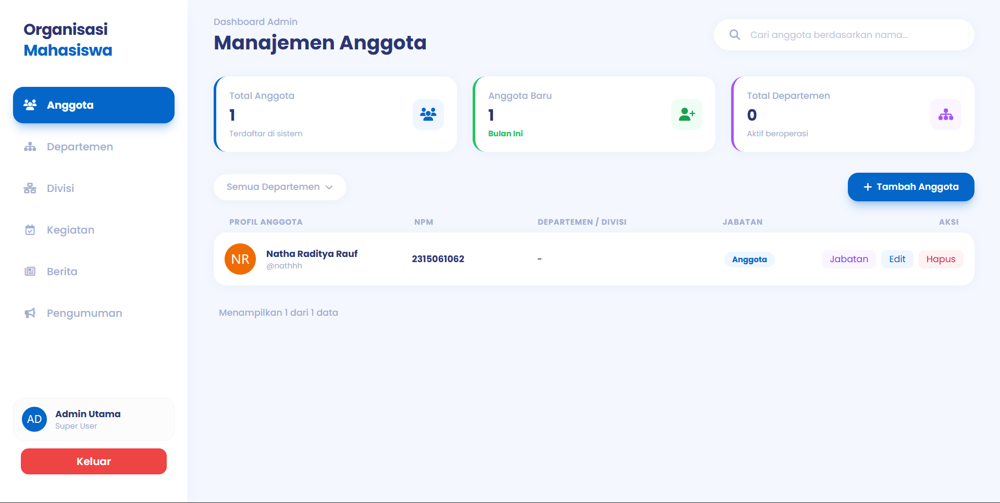

# Sistem Manajemen Organisasi

Sistem ini dirancang untuk mempermudah pengelolaan struktur dan aktivitas organisasi secara menyeluruh. Setiap anggota organisasi dapat memiliki peran spesifik yang ditentukan melalui jabatan, mulai dari level organisasi pusat hingga departemen dan divisi, sehingga struktur hierarki dan tanggung jawab dapat terdefinisi dengan jelas. Admin sistem memberikan penetapan anggota ke jabatan tertentu dengan fleksibilitas penempatan di tingkat organisasi, departemen, maupun divisi, sehingga manajemen sumber daya manusia lebih rapi dan terdokumentasi.

Selain itu, sistem juga menyediakan modul informasi dan publikasi yang komprehensif. Pengumuman, kegiatan, dan berita dapat dibuat dan dikelola secara efisien untuk memastikan setiap informasi sampai kepada pihak yang tepat. Pengumuman bisa ditargetkan untuk seluruh anggota, departemen tertentu, atau divisi tertentu, sementara kegiatan dan berita mendukung dokumentasi aktivitas organisasi dan penyebaran informasi yang cepat.

# Anggota Kelompok
| No | Nama | NPM |
| :- | :- | :- |
| 1 | Natha Raditya Rauf | 2315061062 |
| 2 | Muhammad Abelian Pratama Rasyid | 2315061081 |
| 3 | Muhammad Daffa Aufa Alwan | 2315061030 |
| 4 | Kevin Gantama | 2215061133 |

# Cara Menjalankan Aplikasi
1. Pastikan working directory berada pada `kelompok/kelompok_03/src`
   ```
   cd kelompok\kelompok_03\src
   ```

3. Copy file `.env.example` ke `.env`
   ```
   copy .env.example .env
   ```

3. Edit konfigurasi database pada `.env` jika diperlukan

4. Jalankan `setup.sql` untuk membuat skema database

5. Jalankan perintah untuk menjalankan built-in server php
   ```
   php -S localhost:8000
   ```

6. Akses `http://localhost:8000/index.php` pada browser
   ```
   http://localhost:8000/index.php
   ```

# Screenshot Aplikasi
### 1. Landing Page


### 2. Halaman Login


### 3. Halaman Profile Anggota


### 4. Dashboard Admin
