# 💻 DigiNiaga: Web-Based POS & Inventory Management

> **Tugas Besar Praktikum Pemrograman Web 2025**
>
> **Tema:** Digital Transformation for SMEs (No. 4)
> **Aplikasi:** DigiNiaga

Aplikasi ini adalah sistem kasir (Point of Sales) dan manajemen stok barang berbasis web yang dirancang untuk membantu UMKM dalam mencatat transaksi penjualan, mengelola inventaris, dan menghasilkan laporan keuangan secara digital, akurat, dan *real-time*.

---

## 👥 Anggota Kelompok 28

| No  | Nama Lengkap | NPM | Username GitHub |
| :--- | :--- | :--- | :--- |
| 1 | **M. Hibban Ramadhan** | **2315061094** | [HibbanRdn](https://github.com/HibbanRdn) |
| 2 | **Syahrul Ghufron Al Hamdan** | **2315061063** | [Arlopen](https://github.com/Arlopen) |
| 3 | **M. Reza Rohman** | **2315061004** | [Rezarohman19](https://github.com/Rezarohman19) |
| 4 | **Makka Muhammad Mustova** | **2315061100** | [t0pol](https://github.com/t0pol) |

---

## 📖 Fitur & Fungsionalitas

Aplikasi ini memiliki sistem **Multi-Role Authentication** yang membagi hak akses menjadi tiga:

### 1. 👑 Owner (Pemilik Toko)
Akses penuh terhadap manajemen bisnis.
* **Dashboard Analitik:** Grafik tren penjualan mingguan (Chart.js), total omzet harian, dan notifikasi stok menipis.
* **Manajemen Toko:** Setup profil toko (Nama, Alamat, Kategori) saat pertama kali mendaftar.
* **Manajemen Karyawan:** Menambah, mengedit, dan menghapus akun staf (Kasir & Admin Gudang).
* **Laporan Penjualan:** Filter laporan berdasarkan periode (7 hari/30 hari/Bulan ini) dan **Cetak PDF** dengan kop surat otomatis.
* **Pengaturan:** Update profil owner dan informasi toko.

### 2. 📦 Admin Gudang
Fokus pada manajemen inventaris toko.
* **Manajemen Produk:** Tambah barang baru, edit harga, dan update stok.
* **Manajemen Kategori:** Mengelompokkan barang berdasarkan kategori.
* **Monitoring Stok:** Indikator visual untuk barang yang stoknya menipis (< 5 unit).

### 3. 🛒 Kasir (Point of Sales)
Antarmuka penjualan yang cepat dan responsif.
* **Transaksi:** Keranjang belanja interaktif, kalkulasi total & kembalian otomatis.
* **Pencarian Cepat:** Mencari barang berdasarkan nama atau kode.
* **Cetak Struk:** Menghasilkan struk belanja dalam format PDF siap cetak setelah transaksi berhasil.
* **Riwayat Transaksi:** Melihat histori penjualan harian.

### 🔐 Fitur Keamanan & Umum
* **Enkripsi Password:** Menggunakan `password_hash()` (Bcrypt).
* **Reset Password:** Fitur lupa password menggunakan token hash dan notifikasi Email via SMTP (**PHPMailer**).
* **Cari Toko:** Fitur publik bagi calon karyawan untuk mencari kontak Owner toko.

---

## 🛠️ Teknologi yang Digunakan

Aplikasi ini dibangun menggunakan teknologi **Native** sesuai ketentuan tugas besar:

* **Backend:** PHP Native (Procedural/Structured).
* **Frontend:** HTML5, **Tailwind CSS** (via CDN), JavaScript Native (AJAX & DOM).
* **Database:** MySQL / MariaDB.
* **Libraries (Third-Party):**
    * `FPDF` (PDF Generation untuk Laporan & Struk).
    * `PHPMailer` (Pengiriman Email Reset Password).
    * `Chart.js` (Visualisasi Grafik Dashboard).

---

## 🌳 Struktur Folder

```bash
/kelompok_28
├── /assets                # Aset statis (Logo, Gambar)
├── /docs                  # Screenshot Tampilan
├── /auth                  # Logika Autentikasi (Login, Register, Forgot Pass)
├── /config                # Konfigurasi Database & Email
│   ├── database.php
│   ├── send_email.php
│   └── smtp_secrets.php   # (File ini wajib dibuat manual)
├── /library               # External Libraries (FPDF, Font, PHPMailer)
├── /pages                 # Halaman Antarmuka (Views)
│   ├── /admin_gudang      # Panel Inventory
│   ├── /kasir             # Panel POS & Cetak Struk
│   └── /owner             # Dashboard, Laporan, Users
├── /process               # Logika Pemrosesan Data (Backend Action)
├── db_pos_sme.sql         # File Database SQL
└── index.php              # Landing Page
```

---

## 🚀 Cara Instalasi & Menjalankan

### 1\. Persiapan File & Database

1.  Clone atau Download repository ini.
2.  Masuk ke folder project: `cd kelompok/kelompok_28`.
3.  Buat database baru di MySQL (phpMyAdmin) dengan nama **`db_pos_sme`**.
4.  Import file **`db_pos_sme.sql`** ke dalam database tersebut.
5.  Pastikan konfigurasi database di `config/database.php` sesuai dengan server lokal Anda (User/Pass).

### 2\. Konfigurasi SMTP (Wajib untuk Reset Password)

Fitur "Lupa Password" memerlukan konfigurasi email pengirim.

1.  Buka folder `config/`.
2.  Rename file `smtp_secrets.example.php` menjadi **`smtp_secrets.php`**.
3.  Edit file tersebut dan isi dengan kredensial SMTP Anda (Contoh menggunakan Gmail App Password):
    ```bash
    define('SMTP_HOST', 'smtp.gmail.com');
    define('SMTP_USER', 'email_anda@gmail.com');
    define('SMTP_PASS', 'app_password_anda'); // Bukan password login gmail biasa
    define('SMTP_PORT', 465);
    ```

### 3\. Jalankan Aplikasi

1.  Simpan folder proyek di `htdocs` (XAMPP) atau `www` (Laragon).
2.  Buka browser dan akses:
    `http://localhost/TUBES_PRK_PEMWEB_2025/kelompok/kelompok_28/`

### 4\. Alur Penggunaan (User Flow)

1.  **Daftar Owner:** Lakukan **Register** sebagai Owner baru.
2.  **Setup Toko:** Isi nama toko, alamat, dan kategori bisnis.
3.  **Tambah Karyawan:** Masuk ke menu *Karyawan*, tambahkan akun untuk **Admin Gudang** dan **Kasir**.
4.  **Login Karyawan:** Logout dari Owner, lalu login menggunakan akun karyawan yang baru dibuat untuk mengakses fitur POS atau Gudang.

---

## 📸 Screenshot Aplikasi

### 1. Halaman Utama & Autentikasi
Tampilan landing page yang modern dan responsif, serta fitur registrasi dan pemulihan akun yang aman.

| Landing Page | Login |
| :---: | :---: |
| 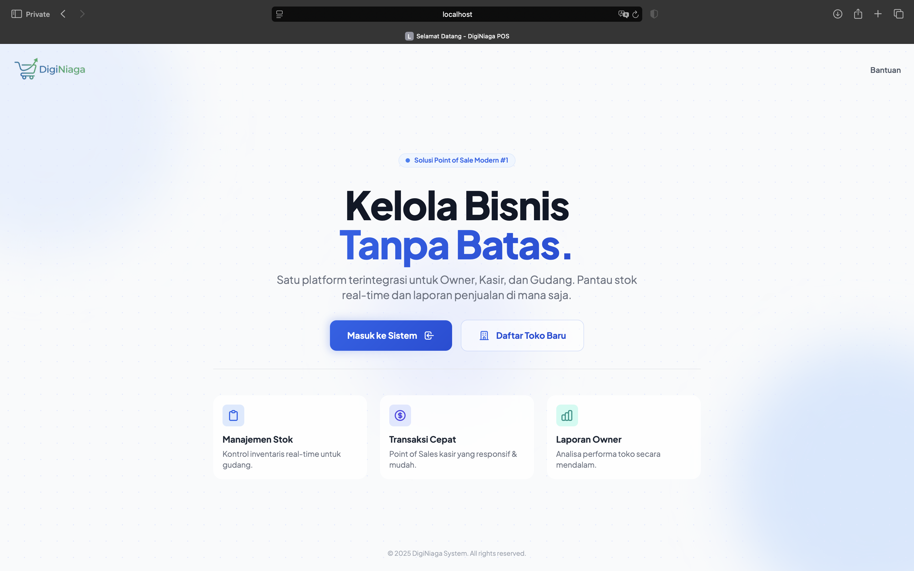 | 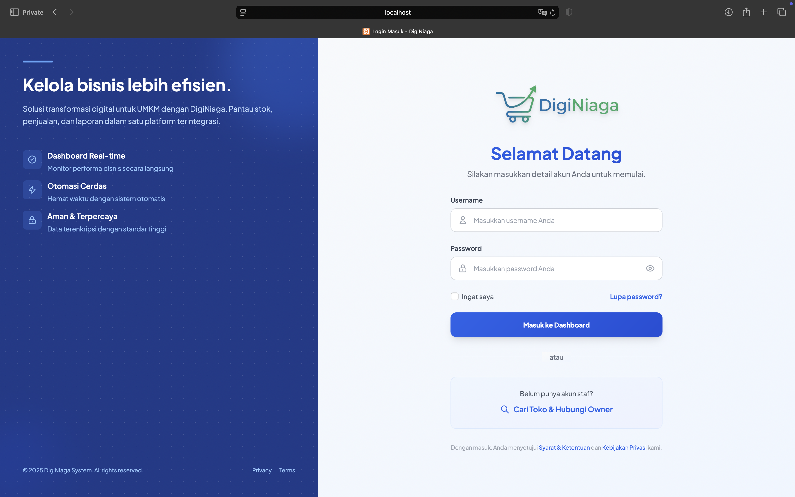 |

| Registrasi Owner | Lupa Password |
| :---: | :---: |
| 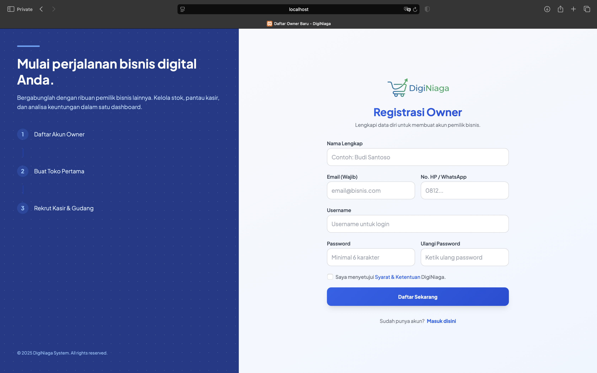 |  |

| Reset Password | Hubungi Owner |
| :---: | :---: |
| 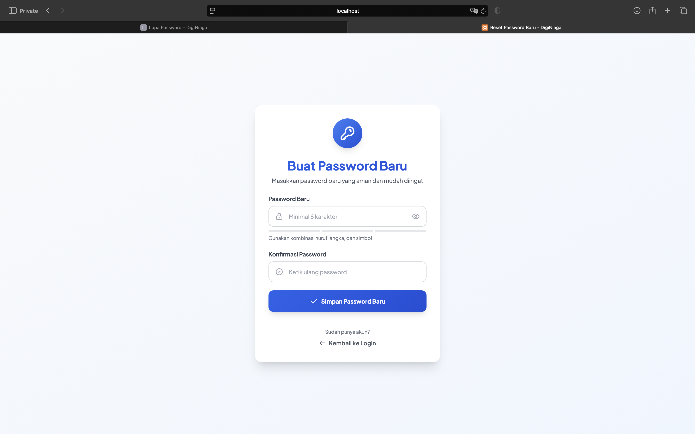 | 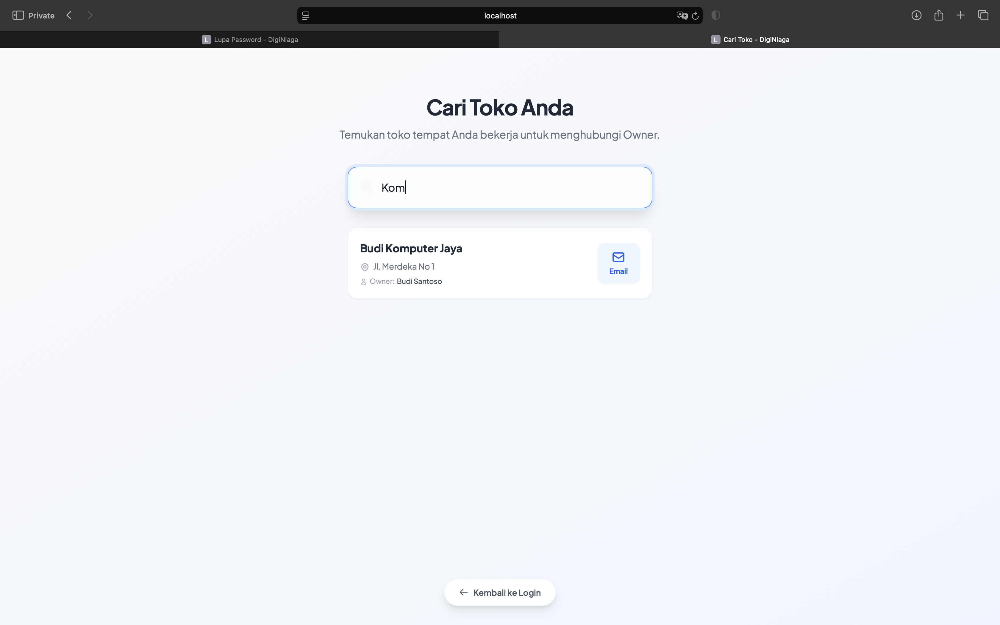 |

### 2. Panel Owner (Pemilik)
Dashboard analitik lengkap untuk memantau performa bisnis dan laporan keuangan.

| Dashboard Ringkasan | Laporan Penjualan |
| :---: | :---: |
| 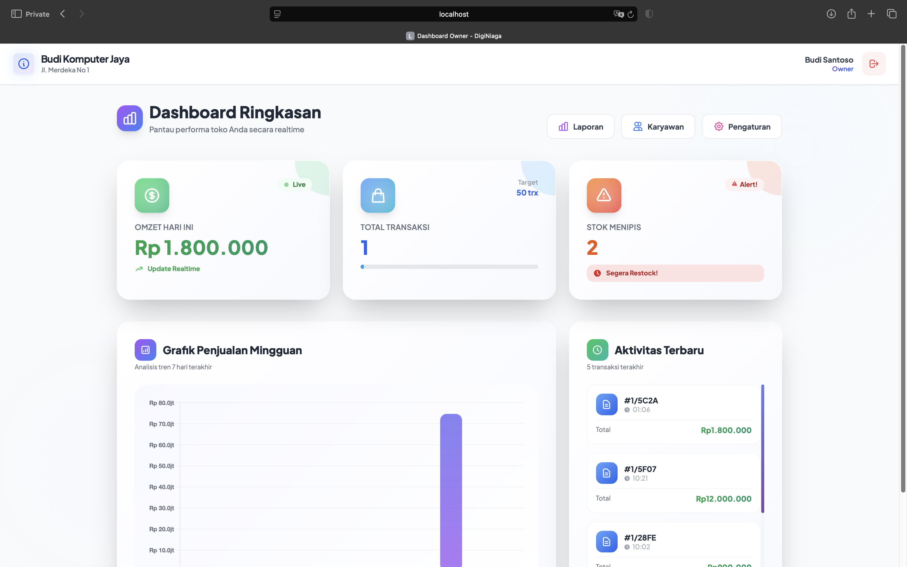 | 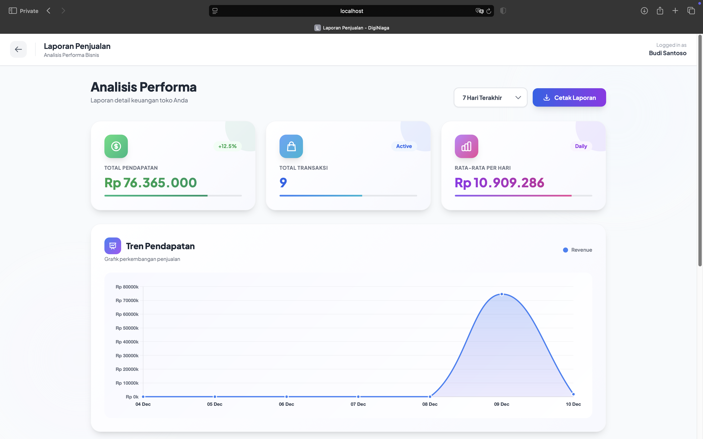 |

| Menejemen Karyawan | Pengaturan |
| :---: | :---: |
| 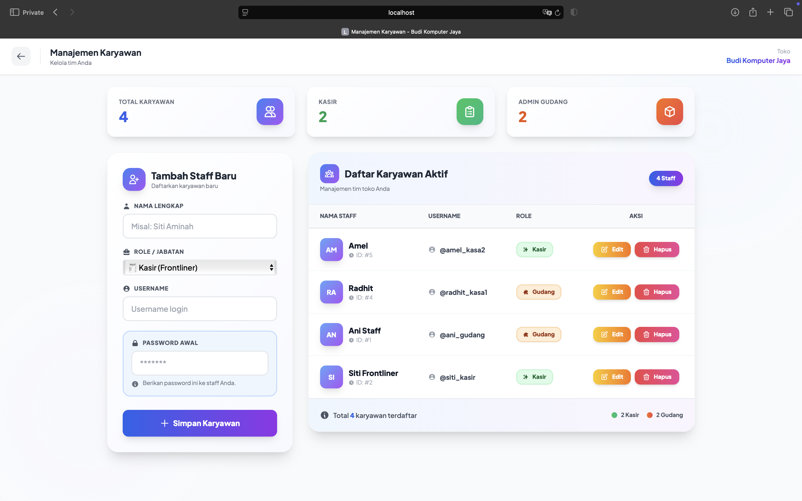 | 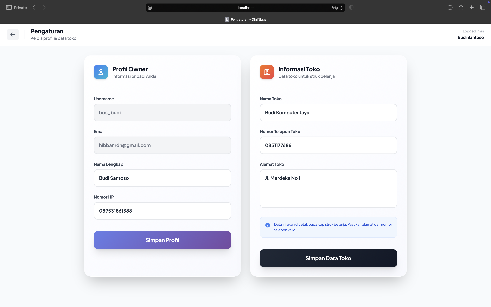 |

### 3. Panel Gudang (Inventory)
Manajemen stok barang yang mudah dengan fitur alert stok menipis.

| Dashboard Gudang | Edit Stok Barang |
| :---: | :---: |
| 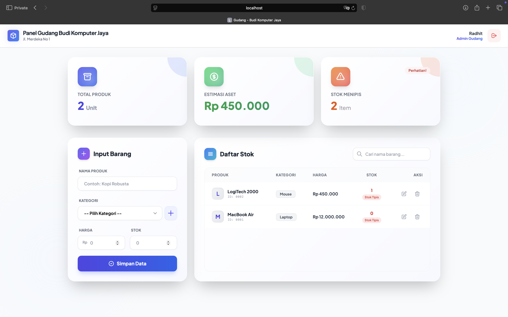 | 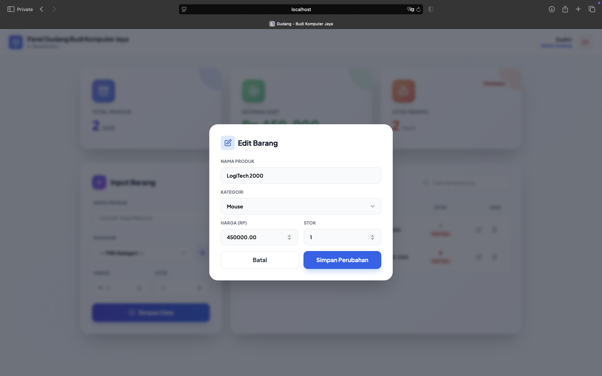 |

### 4. Panel Kasir (Point of Sale)
Antarmuka kasir yang cepat, mendukung pencarian barang via keyboard (F2).

| Halaman Transaksi Kasir | Riwayat Penjualan |
| :---: | :---: |
| 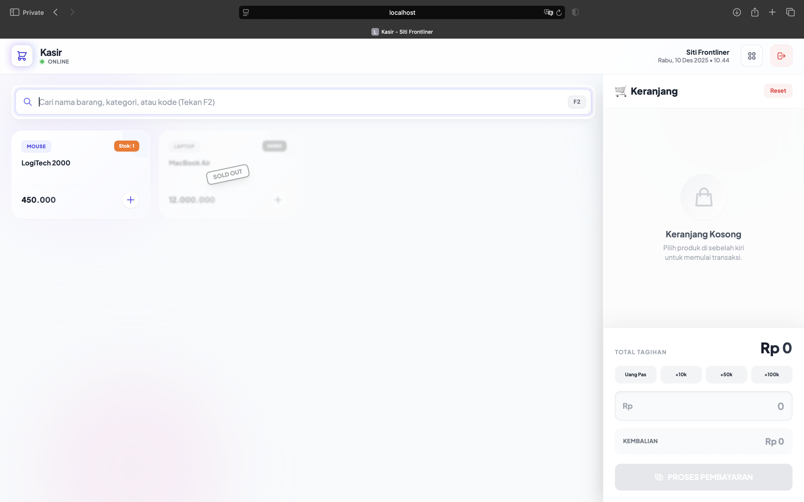 | 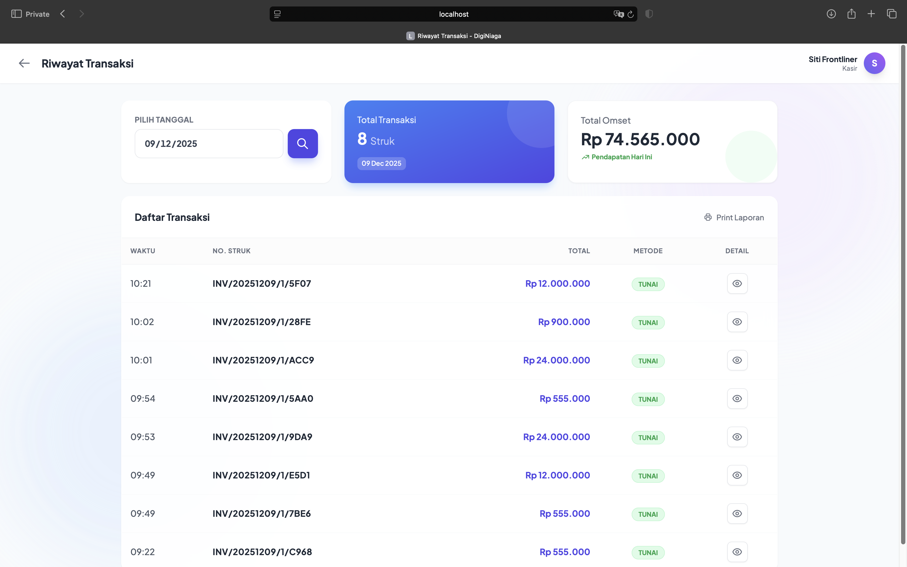 |

| Cetak Struk | 
| :---: | 
| 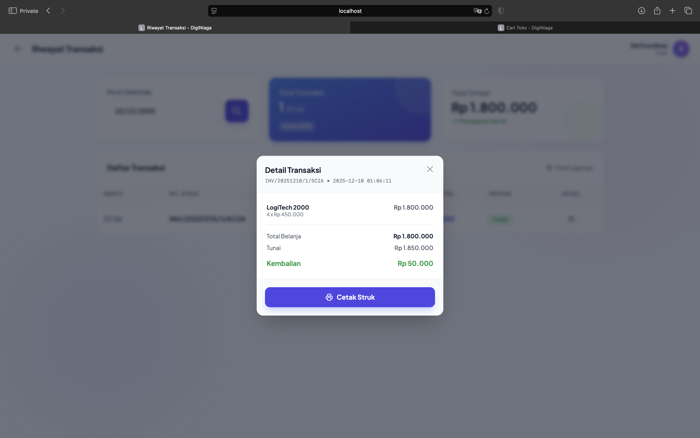 |

### 5. Laporan & Struk
Output Laporan Penjualan dan Struk yang bisa diunduh.

| Laporan Penjualan | Struk Kasir |
| :---: | :---: |
| 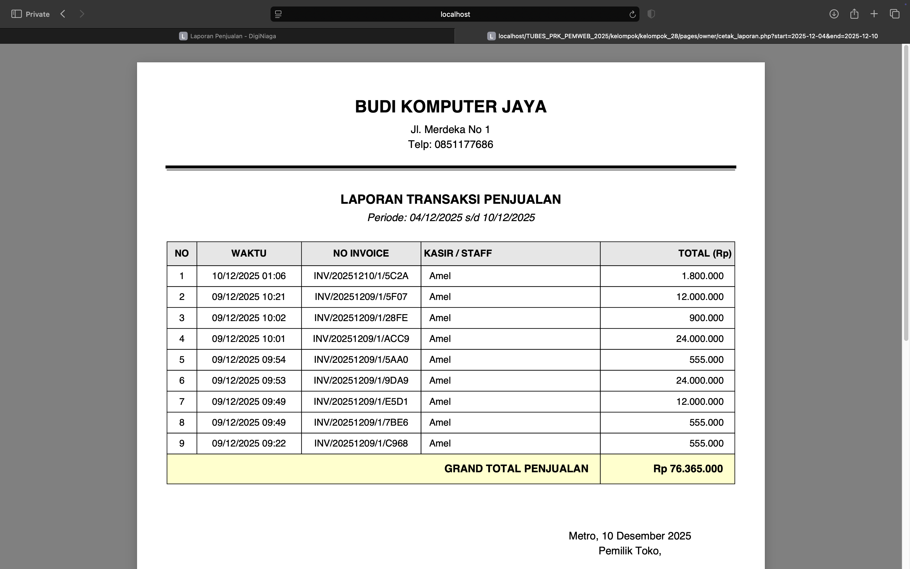 | 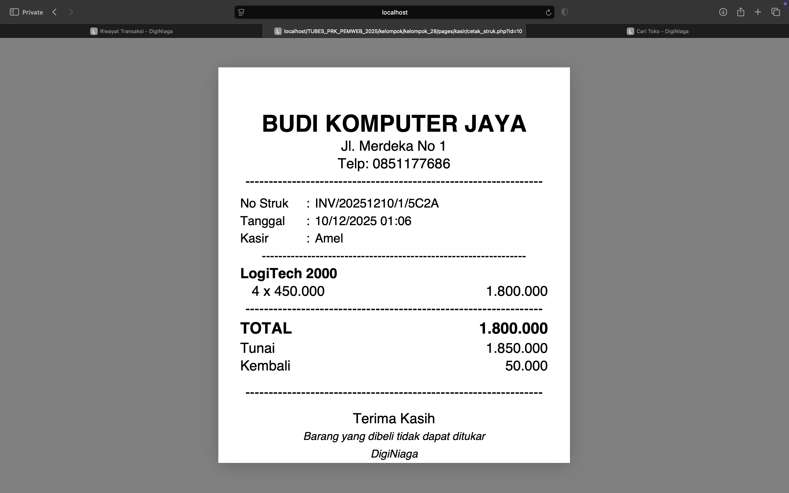 |

---
> **Catatan:**  
> Pastikan koneksi internet aktif saat menjalankan aplikasi karena **Tailwind CSS** dan **Chart.js** dimuat melalui CDN.

---

***Dibuat untuk memenuhi Tugas Besar Praktikum Pemrograman Web - Laboratorium Teknik Komputer Unila.***