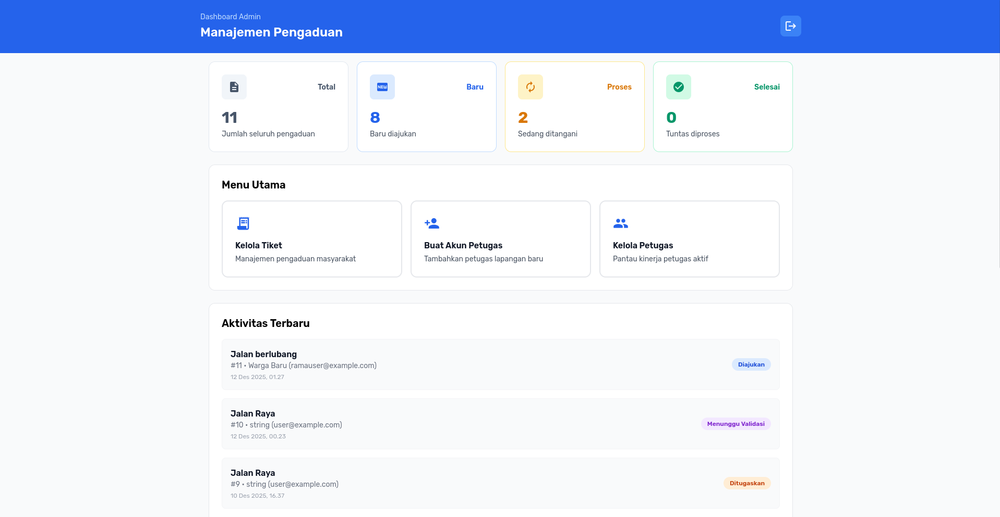
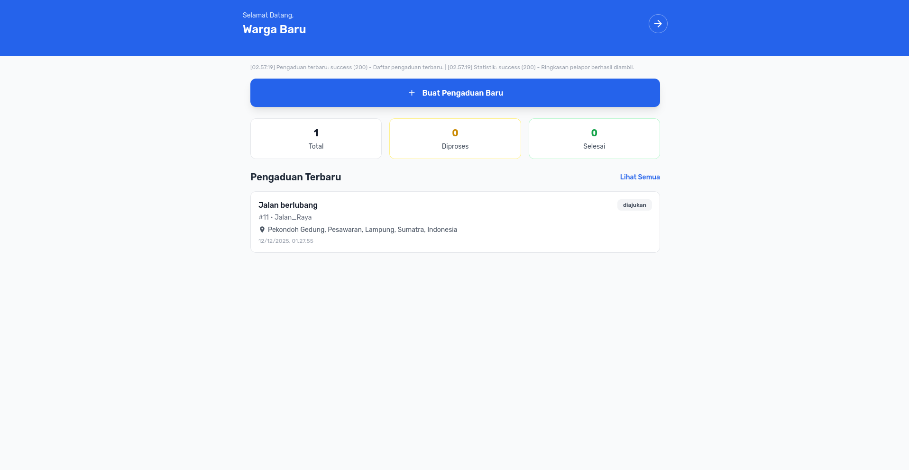

Kelompok 29:

1. Ramayuda Mahardika (2315061126)
2. Arianti Kartika Dewi (2315061047)
3. Recky Valerian (2315061057)
4. Aulia Rahmi Shakira (2315061104)

## ERD

ERD SIPINDA digambar di `src/erd-tubes-ppw.drawio.png` dan bersumber dari file desain `src/erd-tubes-ppw.drawio`.


## Preview Dashboard

- **Admin**  
  
- **Pelapor/Warga**  
  
- **Petugas**  
  

## Instalasi & Cara Menjalankan Backend dan Frontend

1. Pastikan Docker dan Docker Compose sudah terpasang.
2. Salin/atur variabel lingkungan pada `.env` (root repositori) untuk menyesuaikan kredensial MySQL jika dibutuhkan.
3. Jalankan seluruh stack:
   ```bash
   docker compose up -d
   ```
4. Backend REST API tersedia melalui Nginx pada `http://localhost:9090` (mengarah ke `src/backend/public/index.php`).
5. Frontend (halaman pelapor, petugas, admin) tersedia pada `http://localhost:8090` dan mengakses backend melalui host yang sama seperti konfigurasi Docker.
6. Skrip SQL basis data berada di `src/database/sipinda.sql`. Import file tersebut ke MySQL (contoh: `mysql -u sipinda -p sipinda < src/database/sipinda.sql`) sebelum mencoba fitur pelaporan.

Jika tidak memakai Docker, jalankan backend dengan PHP built-in server dari folder `src/backend/public` (`php -S localhost:8000 index.php`) dan layani frontend dengan server PHP/Apache/Nginx biasa dari folder `src/frontend`, lalu sesuaikan variabel koneksi database di masing-masing konfigurasi.

## Dokumentasi Singkat

- Alur pelapor: registrasi/login, membuat tiket pengaduan, memantau status, dan unggah lampiran melalui modul `src/frontend/pelapor` yang berinteraksi dengan API `/api/pelapor/...`.
- Alur petugas/admin: kelola akun petugas, validasi tiket, serta melihat ringkasan di dashboard admin/petugas (`src/frontend/admin`, `src/frontend/petugas`).
- Seluruh struktur tabel dan data awal mengikuti ERD yang tercantum di atas dan dump SQL `src/database/sipinda.sql`.

### Alur Status Pengaduan (6 Status)

1. `diajukan` – Pelapor membuat tiket, status awal otomatis tercatat pada `complaint_progress`.
2. `diverifikasi_admin` – Admin memverifikasi laporan yang valid atau dapat menolak tiket (`ditolak_admin` berada di luar 6 status utama namun tercatat jika terjadi penolakan).
3. `ditugaskan_ke_petugas` – Admin memilih petugas tersedia; status kelola tugas bergeser ke petugas.
4. `dalam_proses` – Petugas menerima tugas lalu memulai pengerjaan di lapangan.
5. `menunggu_validasi_admin` – Petugas mengunggah bukti penyelesaian dan menandai tugas selesai; admin perlu memvalidasi.
6. `selesai` – Admin menyetujui bukti, tiket ditutup; pelapor melihat progres selesai dari dashboard mereka.

Setiap perubahan status tercatat di timeline (table `complaint_progress`) sehingga pelapor, admin, dan petugas memiliki riwayat lengkap.

### Dokumentasi Backend (Swagger/OpenAPI)

- `src/backend/docs/auth.openapi.yaml` – Endpoint autentikasi umum (register/login pelapor, login admin/petugas, refresh token).
- `src/backend/docs/pelapor.openapi.yaml` – Operasi yang dapat dilakukan pelapor/warga seperti membuat pengaduan, melihat daftar/status, dan dashboard ringkas.
- `src/backend/docs/admin.openapi.yaml` – Seluruh endpoint admin: verifikasi tiket, penugasan petugas, validasi bukti, manajemen akun petugas, hingga statistik dashboard.
- `src/backend/docs/officer.openapi.yaml` – Endpoint petugas untuk menerima/menjalankan tugas, update progres, unggah bukti penyelesaian, serta melihat profil tugas aktif/selesai.
